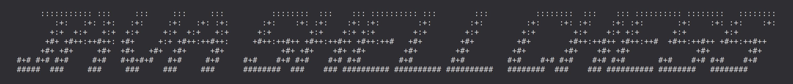

**Well, the name sort of says it all!** This is a shell-based version of Chess written in Java.

## About
This version of the game is fully compliant with FIDE rules.

## Features
Two player game
Play in your Linux Terminal/Java Console
Clean Minimal UI